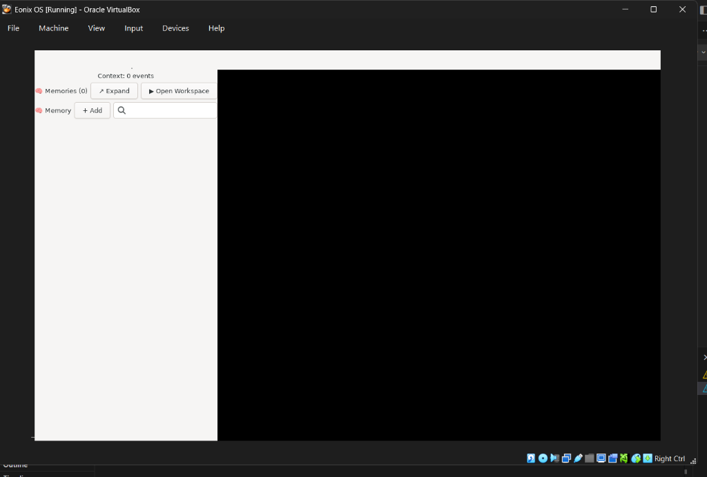

# Eonix OS

[](https://github.com/shahnoor-exe/eonix-os/releases/tag/v0.9.0)
[](https://github.com/shahnoor-exe/eonix-os/actions)
[](docs/ai-model.md)
[](docs/getting-started.md)
[](LICENSE)

> An AI-native operating system with live LightGBM
> scheduling, ChromaDB memory, GTK4 desktop, and
> 5 always-on agents. Bootable ISO.

## Quick Start
1. [Download eonix-os-0.9.0.iso](https://github.com/shahnoor-exe/eonix-os/releases/tag/v0.9.0)
2. Boot in VirtualBox (4GB RAM, VMSVGA display)
3. See [Getting Started](docs/getting-started.md)

## Docs
- [Getting Started](docs/getting-started.md)
- [Hub API](docs/api.md)
- [AI Model](docs/ai-model.md)
- [Changelog](docs/changelog.md)

## Quick Start (Dev)

```bash
git clone https://github.com/shahnoor-exe/eonix-os.git
cd eonix-os
bash install/eonix-install.sh --dev
bash start_eonix.sh
python3 eonix-shell/shell.py
```

## Features Table

| Feature              | Status  | Since   |
|----------------------|---------|---------|
| AI Scheduler         | OK Live | Month 1 |
| EONIX MIND v2.0      | OK Live | Month 4 |
| GoalEngine           | OK Live | Month 4 |
| Persistent Memory    | OK Live | Month 4 |
| ContextAgent         | OK Live | Month 3 |
| ResourceAgent        | OK Live | Month 4 |
| SyncDaemon (LAN)     | OK Live | Month 5 |
| Android App          | OK Live | Month 5 |
| Eonix Hub            | OK Live | Month 5 |
| EonixShell           | OK Live | Month 6 |
| NL Interpreter       | OK Live | Month 6 |
| Installer            | OK Live | Month 6 |
| Desktop GUI          | OK Live | Month 7 |
| Bootable ISO         | OK Live (GTK4 desktop confirmed) | Month 9 |

## Test Coverage

162+ target tests | 30 CI jobs | 0 failures target

## Week 27 ISO Build (Codespaces)

Week 27 requires Linux tooling for debootstrap/live ISO preparation. Use GitHub Codespaces for the full pipeline:

```bash
bash iso/codespaces_build.sh
RUN_FULL_BUILD=1 bash iso/codespaces_build.sh
```

Detailed instructions are in docs/week27_codespaces.md.

## Boot EONIX OS

You can boot the full ISO on VirtualBox (4GB RAM, 2 CPUs, VMSVGA display) or QEMU:
```bash
qemu-system-x86_64 -cdrom eonix-os-0.9.0.iso -m 4G
```



## Roadmap

Month 7 -> Eonix Desktop (GTK GUI, shipped v0.7.0)
Month 8 -> Bootable ISO
Month 9 -> Hardware testing
Month 10 -> Public release

## Author

Shahnoor Ahmed Laskar | B.E. C.S.E. (Data Science) | Chandigarh University (Batch 2024-28)
https://github.com/shahnoor-exe/eonix-os
